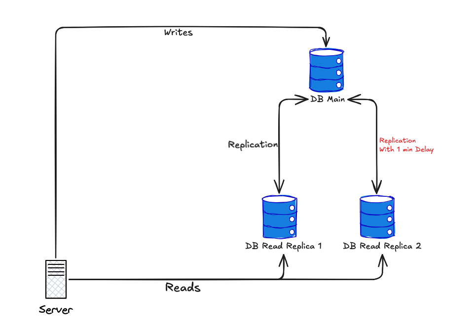

# Node.js Project with PostgreSQL in Docker and Replication

This example demonstrates how to create a lightweight Node.js application, containerized with Docker, connected to a PostgreSQL cluster composed of a primary node (`db-main`) and two read replicas (`db-replica1` and `db-replica2`).

## Infrastructure Overview



The infrastructure consists of:
- **Primary Database**: Handles all write operations and serves as the source for replication
- **Replica 1**: Immediate read replica for fast read operations
- **Replica 2**: Delayed read replica (1-minute delay) for testing delayed replication locally
- **Node.js Application**: Fastify server with automatic replica distribution using Drizzle ORM

## Folder Structure

```
project-root/
├── postgres/
│   ├── init-primary.sh
│   └── init-replica.sh
├── app/
│   ├── Dockerfile
│   ├── package.json
│   ├── tsconfig.json
│   └── src/
│       ├── index.ts
│       └── database.ts
├── docker-compose.yml
└── README.md
```

## How to Run

### 1. Start Containers

```bash
docker-compose up -d
```

### 2. Check Container Status

```bash
docker-compose ps
```

### 3. Check Logs

```bash
docker-compose logs app
docker-compose logs db-main
docker-compose logs db-replica1
docker-compose logs db-replica2
```

## API Documentation

### Swagger UI
Access the interactive API documentation at:
```
http://localhost:3000/documentation
```

## API Endpoints

### Health Check
```bash
curl http://localhost:3000/health
```

### List Tasks (READ - uses replicas)
```bash
curl http://localhost:3000/tasks
```

### List Tasks from Replica 1 (immediate sync)
```bash
curl http://localhost:3000/tasks/replica1
```

### List Tasks from Replica 2 (delayed by 5 minutes)
```bash
curl http://localhost:3000/tasks/replica2
```

### Create Task (WRITE - uses primary)
```bash
curl -X POST http://localhost:3000/tasks \
  -H "Content-Type: application/json" \
  -d '{"title": "New task"}'
```

### Update Task (WRITE - uses primary)
```bash
curl -X PUT http://localhost:3000/tasks/1 \
  -H "Content-Type: application/json" \
  -d '{"title": "Updated task", "completed": true}'
```

### Delete Task (WRITE - uses primary)
```bash
curl -X DELETE http://localhost:3000/tasks/1
```

## PostgreSQL Configuration

### Primary Database (db-main)
- **Port**: 5432
- **User**: postgres
- **Password**: Strong!Pa55word
- **Database**: appdb

### Replica 1 (db-replica1)
- **Port**: 5433
- **User**: postgres
- **Password**: Strong!Pa55word

### Replica 2 (db-replica2) - Delayed Replica
- **Port**: 5434
- **User**: postgres
- **Password**: Strong!Pa55word
- **Delay**: 1 minute (recovery_min_apply_delay = '1min')

## Technologies Used

- **Node.js**: JavaScript runtime
- **TypeScript**: Type-safe JavaScript
- **Fastify**: Fast web framework
- **Drizzle ORM**: Modern ORM for TypeScript/JavaScript
- **PostgreSQL**: Relational database
- **Docker**: Containerization
- **Docker Compose**: Container orchestration
- **Swagger**: API documentation and testing interface

## Replication Strategy

- **Read Operations**: Automatically distributed between replicas
- **Write Operations**: Always directed to primary database
- **Failover**: Automatically configured by Drizzle ORM
- **Delayed Replica**: Replica 2 has a 1-minute delay for testing delayed replication

## Environment Variables

The application uses environment variables for configuration. These are automatically set in the `docker-compose.yml` file for the containerized environment:

```yaml
environment:
  DB_HOST_MAIN: db-main
  DB_HOST_REPLICA1: db-replica1
  DB_HOST_REPLICA2: db-replica2
  DB_USER: postgres
  DB_PASSWORD: Strong!Pa55word
  DB_NAME: appdb
```

For local development without Docker, you can create a `.env` file in the `app/` directory with the same variables.

## Database Migrations

The application automatically runs migrations on startup. The migrations are generated from the schema defined in `src/database.ts`.

### Manual Migration Commands

```bash
cd app

# Generate new migration from schema changes
npm run db:generate

# Run migrations manually
npm run db:migrate

# Open Drizzle Studio (database GUI)
npm run db:studio
```

### Migration Files

Migrations are stored in the `drizzle/` directory and are automatically applied when the application starts.

## Local Development

For local development without Docker:

```bash
cd app
npm install
# Create .env file with your local PostgreSQL settings
npm run dev
```

Make sure you have PostgreSQL running locally and update the environment variables in the `.env` file to match your local database configuration.

## Troubleshooting

### Connection Issues
1. Check if all containers are running: `docker-compose ps`
2. Check logs: `docker-compose logs`
3. Wait a few seconds for replication to be established

### Replication Issues
1. Check if primary database is configured correctly
2. Check replica logs for connection errors
3. Restart containers if necessary: `docker-compose restart`

## Testing Delayed Replica

To test the 1-minute delay on replica 2:

1. Create a new task:
```bash
curl -X POST http://localhost:3000/tasks \
  -H "Content-Type: application/json" \
  -d '{"title": "Test delayed replica"}'
```

2. Immediately check replica 1 (should show the new task):
```bash
curl http://localhost:3000/tasks/replica1
```

3. Check replica 2 (should NOT show the new task for 1 minute):
```bash
curl http://localhost:3000/tasks/replica2
```

4. Wait 1 minute and check replica 2 again (should now show the new task):
```bash
curl http://localhost:3000/tasks/replica2
```

## Cleanup

To stop and remove all containers and volumes:

```bash
docker-compose down -v
``` 